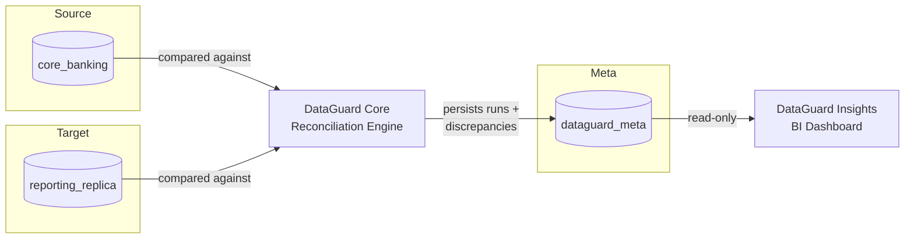
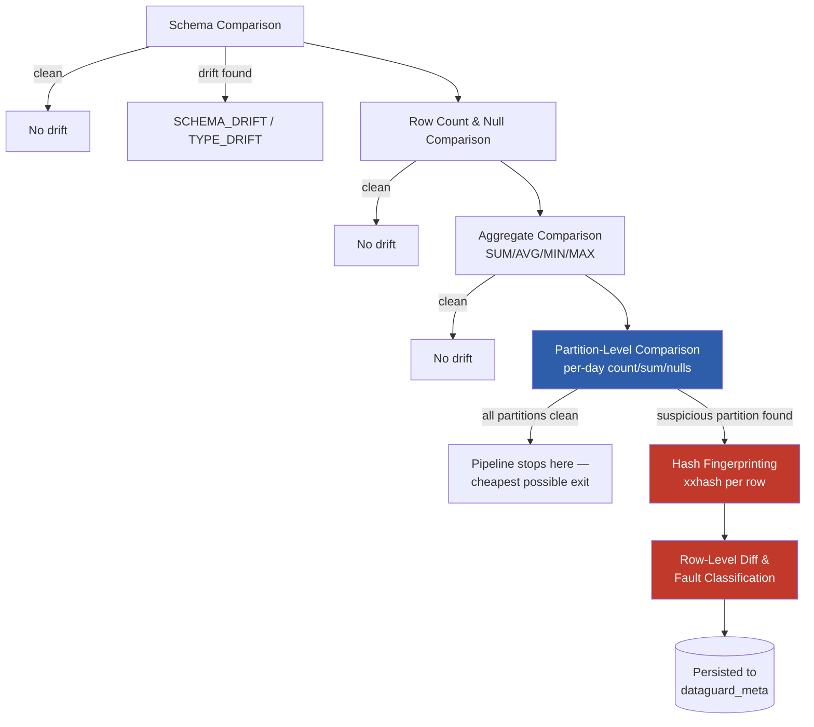

# DataGuard Core

A Python-based data integrity platform that hierarchically reconciles two relational
datasets — a simulated core banking system (`core_banking`) and a downstream reporting
replica (`reporting_replica`) — using schema comparison, row/null counts, aggregate
validation, partition-level analysis, and hash-based row fingerprinting.

Built to reflect a real production concern for core-banking database systems: verifying
that a downstream analytics/reporting copy of a transactional database hasn't silently
drifted from its source of truth.

## Architecture

See [docs/architecture.md](docs/architecture.md) for the full design, including the
6-level reconciliation hierarchy (schema → count → aggregate → partition → hash → row).

## System overview



## Reconciliation pipeline



*Only partitions flagged as suspicious at the Partition-Level step proceed to the
expensive Hash Fingerprinting and Row-Level Diff steps — this gating is what makes
the engine 2.3x–6.4x faster than a naive full comparison (see Benchmarks below).*

## Reconciliation hierarchy

1. **Schema** — tables, columns, types, nullability
2. **Row count & nulls** — per-table counts, duplicate primary keys
3. **Aggregates** — COUNT/SUM/AVG/MIN/MAX (exact equality on financial fields)
4. **Partition** — per-day count/sum/null-count buckets, isolates *which* day drifted
5. **Hash fingerprinting (xxhash)** — cheaply narrows a suspicious partition to candidate rows
6. **Row-level diff** — exact field comparison, classified into a fault type

Only partitions flagged as suspicious at step 4 pay the cost of steps 5–6 — this is
what makes the engine faster than a naive full-table comparison at scale (see
[docs/benchmarks.md](docs/benchmarks.md) for measured numbers).

## Quickstart

```bash
# 1. Start Postgres
docker compose -f docker/docker-compose.yml up -d

# 2. Set up your environment
python -m venv venv
venv\Scripts\Activate.ps1        # Windows
pip install -r requirements.txt
copy .env.example .env           # Windows

# 3. Run the full demo
python -m app.cli run
```

This generates 100K synthetic transactions, injects a known set of labeled faults
into the reporting replica, runs the full reconciliation pipeline, and prints a
summary of what was detected and its dollar impact.

## Testing

```bash
pytest -v
```

13 tests covering every reconciliation module plus one full end-to-end integration test.

## Accuracy & performance

- **Detection accuracy:** 100% precision / 100% recall against a labeled
  fault-injection manifest (see `docs/accuracy_report.json`).
- **Performance:** 2.3x–6.4x faster than a naive SQL `EXCEPT`-based full comparison,
  scaling with dataset size (100K → 1M rows). See `docs/benchmarks.md`.

## Known limitations

See [docs/algorithm.md](docs/algorithm.md#known-limitations) for an honest accounting
of current edge cases — notably, duplicate-row detection is heuristic (matches on
account/amount/timestamp) and `PARTITION_ANOMALY` (volume-vs-history) is defined in
the fault catalogue but not yet implemented as a distinct check.

## Companion project

[DataGuard Insights](../dataguard-insights) is a Streamlit BI dashboard built on top
of this engine's output, translating discrepancies into business-facing metrics —
dollar exposure, affected accounts, and integrity trends over time.
